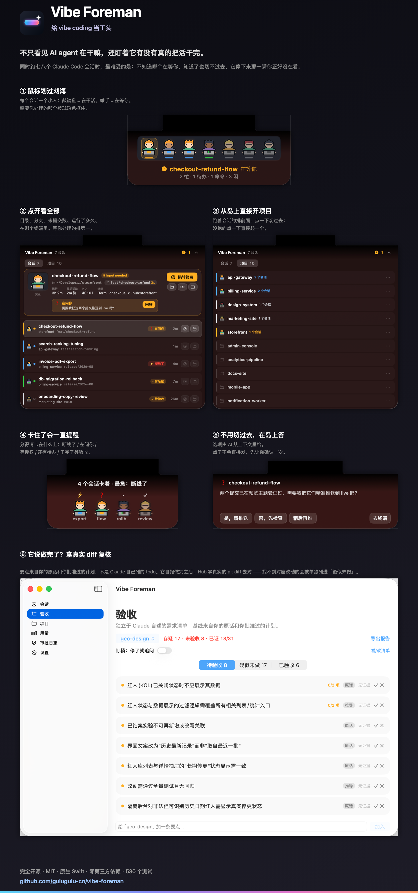
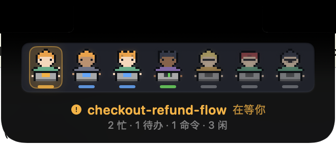
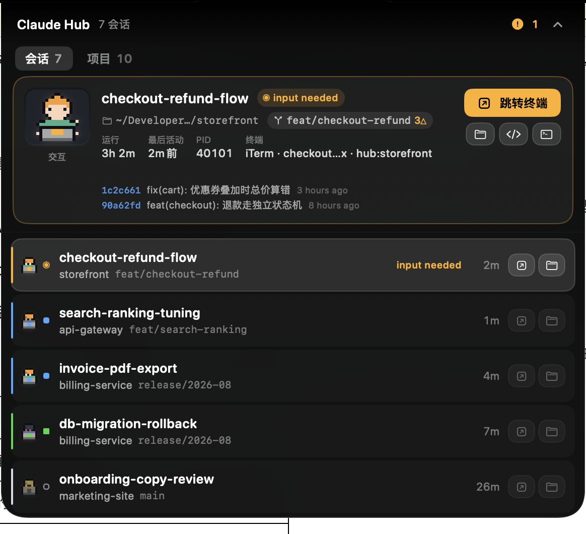
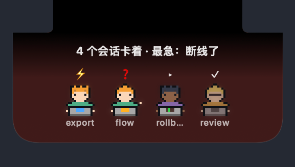
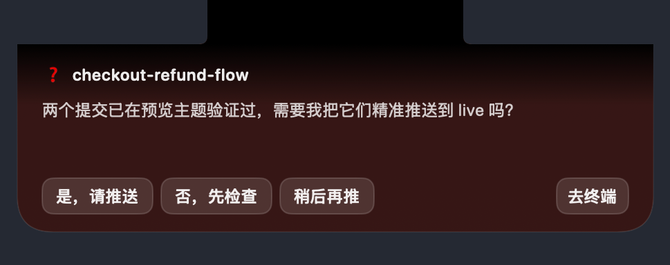
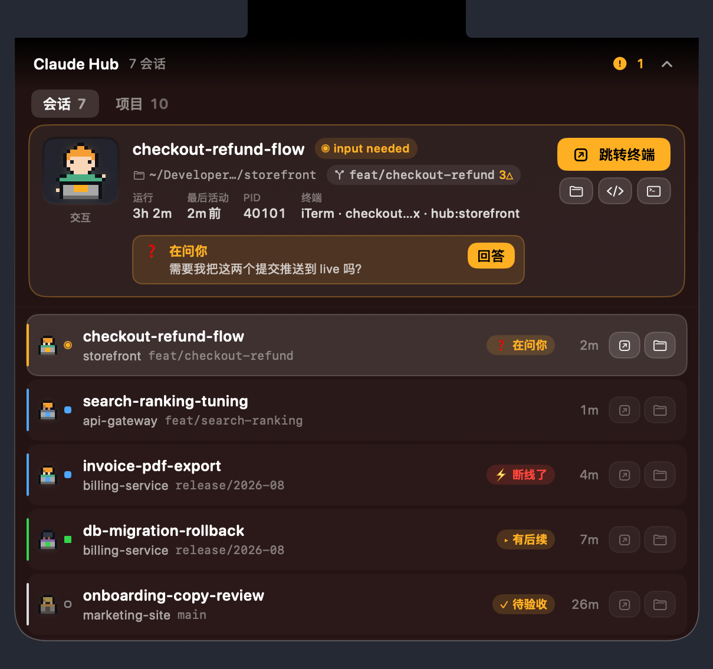
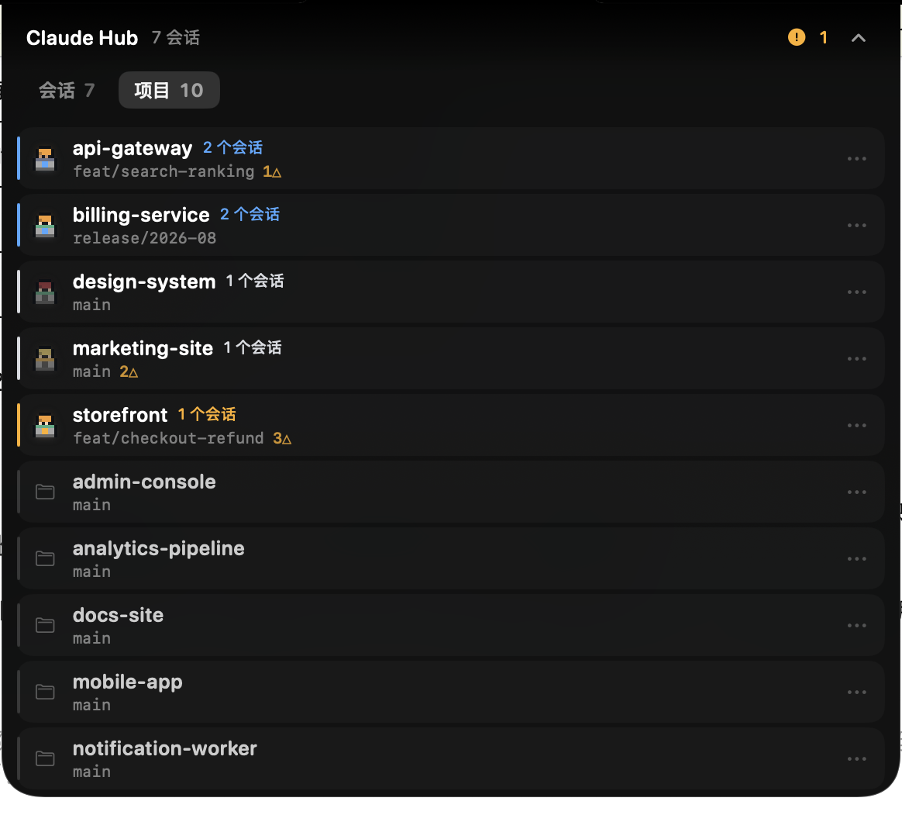
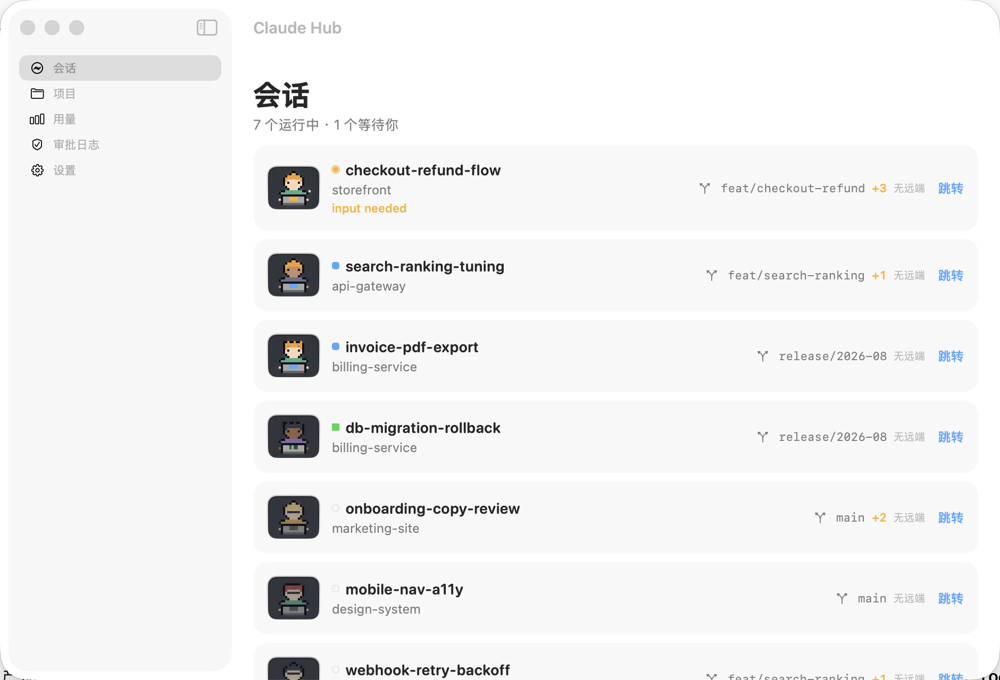

<p align="center">
  
</p>

<h1 align="center">Vibe Foreman Free</h1>

<p align="center">把 MacBook 的刘海变成本地 AI 编程 agent 的<b>工头</b>。</p>

它不只是让你看见 agent 在干嘛 —— 它盯着它们**有没有真的把活干完**。

<p align="center">
  <a href="docs/poster.png"></a>
</p>

同时跑七八个 Claude Code 会话的时候，最难受的是三件事：**不知道哪个在等你**、
**知道了也切不过去**、以及**它停下来的那一瞬你正好没在看**。
Vibe Foreman Free 解决的就是这三件事。

<p align="center">
  
</p>

鼠标经过刘海就展开。每个会话一个小人：**敲键盘 = 在干活，举手 = 在等你，
静止 = 空闲**。需要你处理的那个会被琥珀色光晕框住，名字直接顶在下面 ——
不用逐个去认颜色。

## 下载

[**最新版本**](../../releases/latest) · macOS 26+ · Apple Silicon 和 Intel 通用

1. 打开 dmg，把 **Vibe Foreman Free** 拖进「应用程序」
2. 打开它 —— hook 会自己装好，没有第三步

首次启动时 app 会把 9 类 hook 写进 `~/.claude/settings.json`（只动它自己的那几条，
你手写的 hook 不受影响），并把 `hubctl` 同步到 `~/.local/bin`。
设置页能看到装了没有，装坏了那里也有一键修复。

> 应用是自签名未公证的，首次打开需要**右键 → 打开**，
> 或者 `xattr -dr com.apple.quarantine "/Applications/Vibe Foreman Free.app"`。

## 它能做什么

### 一眼看清七个会话在干嘛



点小人展开。上面是选中会话的全貌：**当前目录、分支、未提交数、最近提交、
运行了多久、在哪个终端里**。下面是全部会话，等你处理的永远排第一。

分支和目录不是装饰 —— 同一个项目经常开好几个会话，只看项目名它们长得一模一样。

### 点一下回到那个终端

这是这个工具最初被做出来的原因。旧的做法是靠窗口名做字符串匹配，
而 tmux 的 `automatic-rename` 会把窗口名改成前台进程名（实测出现过窗口名变成
`2.1.173`——那是 claude 的版本号），十个窗口能对上两个。

现在全程只用整数 PID 和 UUID：状态读 Claude Code 自己维护的
`~/.claude/sessions/<PID>.json`，跳转用 iTerm 的 `jobPid` 向上走进程树。
tmux 会话和非 tmux 会话都覆盖。

### 它停下来了而你没在看 —— 岛会一直提醒到你处理

<p align="center">
  
</p>

以前岛只在**事件发生那一瞬间**提醒：完成了闪两秒，然后收回去，之后再也不吭声。
你要是正好在看另一块屏、或者干脆没在看，这件事就永远错过了。
一个跑了一小时、断在半路的会话，可能几小时后才被发现。

现在只要还卡着就持续提醒，而且分得清卡在什么上：

| | 什么情况 | 怎么测出来的 |
|---|---|---|
| ⚡ | 连接断了，这轮没跑完 | transcript 尾部的 `isApiErrorMessage` 标记 |
| ❓ | 它在问你一个问题 | 最后一条回复的收尾是个问句 |
| ⚠ | 在等授权或等你选 | Claude 自己写的 `waiting` 状态 |
| ▸ | 做完一段，清单里还有 | `~/.claude/tasks/` 里的待办 |
| ✓ | 安静地干完了，等你验收 | 观测到的一整段工作时长 |

**前四类完全不靠 AI 判断** —— 都是从 Claude Code 自己落盘的文件里直接读出来的，
不花额度、不会误报。只有"这轮到底说了什么"才会调一次
`claude -p` 生成一句摘要，用的是你已经登录的订阅额度，不需要另配 API key。
它失败了也只是文案糙一点，提醒照发。

**它也会闭嘴。** 提醒按 0 / 3 / 8 / 20 分钟递增，最多主动打断五次；
一件事卡过两小时之后就只留跑马灯，不再弹出来。
固定间隔地喊在"我知道但暂时不想处理"的时候会变成必须关掉的骚扰 ——
一个提醒功能只有在会闭嘴的时候才有人愿意留着它。

<p align="center">
  
</p>

收起来的时候，卡住的事在下唇滚动。静止的小徽章在余光里等于不存在。

### 不用切过去，直接在岛上回答

<p align="center">
  
</p>

AI 问"需要我帮你推送到 live 吗？"的时候，切过去只是为了敲一个"是"。
点小人直接在岛上答，选项由 AI 从上下文里给。

**点了不会直接发。** 先显示「将发送到 iTerm · xxx：是」让你确认一次 ——
刘海很小，而那一下可能是往生产环境推代码。发送前还会重读一次会话状态，
中途变成在干活就取消并告诉你（说明你已经自己在那边动手了）。
只发一行纯文本 + 回车，不发控制字符、不发多行。

<p align="center">
  
</p>

展开列表里每一行都带着自己卡在什么上，选中的那个把原因摊开在详情卡里。

### 跟着你在看的那块屏走

岛以前锁死在内建的刘海屏上。接了外接显示器的话，你看着另一块屏时，
任何提醒在物理上都不在你的视野里 —— 那时候再怎么加动效都是白做。
现在光标在哪块屏，岛就在哪块屏；没有刘海的屏上用胶囊形态。

只在收起来的时候搬家。展开着的时候搬会把你正要点的按钮从指针底下挪走。

### 从岛上直接开项目



「开发 xxx」是最高频的动作，不该要求先打开一个主窗口。
跑着会话的项目排前面，点一下就切过去；没跑的点一下直接起一个。
右侧的 `⋯` 里可以选 `--continue`、跳过权限、只开终端等等。

### 它说做完了，拿真实 diff 复核

同时开五六个会话时，真正的成本不是等待，是**核对**。每个会话结束都给你一份看起来很完整的报告，而你没有精力逐个去仓库里翻。

Hub 从**你的原话和你批准过的计划**里拆出要点（不是 Claude 自己列的 todo —— 那份天然会漏掉它不想做的事），按项目累积、跨会话保留。它收工时被拦下来逐条报证据，然后走旁路复核：拿真实的 `git diff` 去对，**说辞只用来定位该看哪几个文件，以 diff 为准**。

结论只有两档：**已验收** / **疑似未做**。刻意不留"部分完成"—— 有中间档的话模型会一律往那里躲，产出一个什么都没说的结论。

还有一档更隐蔽的漏：**它压根不提的事，没有任何东西会去查**。所以另有一条独立的路直接去仓库里搜（commit 信息、改动文件名、现有文件名三处），一点痕迹都没有的会被单拎出来问。

想更进一步，可以让 Hub 自己跑 `swift test` 之类来验，而不是听它说"测过了"。这是全案唯一会执行命令的功能，三道闸：白名单（argv 开头完全匹配，刻意排除 `npx`、`npm install` 和 git 的一切写操作）、拒绝 shell 元字符（不转义，直接拒）、默认关且每条命令首次执行前要你点头。

### 它停下来就追问，直到活干透

只会说「继续」的盯梢能防它停，防不了它**每次都继续、每次都做表面功夫**。所以追问是一份轮换的清单，每条都是一个它不想被问的角度：

> 这轮的产出具体落到了哪些文件？给完整路径。答不上路径就说明只写了结论没落地。
>
> 你落的那些改动，下一次构建/发布之后还在不在？不确定就去看构建脚本，别猜。

三种问法交替：通用清单（可以换成你自己的）、从验收清单当场生成的具体条目（"你说做完了「X」，但 diff 里找不到，是哪个文件的哪几行？"）、以及针对它刚说的那段话临时想的问题。只问通用的，几轮之后它就摸清套路；只问清单又变成对答案。

三条硬约束都是实机撞出来的：**只有 `busy` 算在干活**（`shell` 是挂着后台命令，早期当成在干活，停了 20 分钟一次没催到）；**你在打字时绝不发**（注入是往光标位置敲字，会拼到你没发完的那句后面）；**画面在变就不打扰**（慢命令往外吐输出时转圈符号会被滚屏顶掉，看画面比看符号可靠）。

**默认全关。** 它会往你的终端里敲字，不该在你不知情时自动插话。

### 关掉终端窗口就是结束

tmux 的默认语义是「关窗口 = detach，进程照跑」。这和人的直觉相反：你关掉窗口就是干完了，之后看到界面上「1 个会话」还亮着，只会认为界面在撒谎。

现在检测到没有终端连着就结束它 —— 但**结束前先把 sessionId 记下来**，项目行上出现「接着上次」，一键回到原来的上下文。只记真有 transcript 的：一次都没说过话的会话没有 transcript，记了只会长出一个点下去报错的按钮。

不在 tmux 里的会话（VS Code 扩展、直接开的终端）一个都不碰 —— 那种情况判断不了"有没有终端连着"。新起的会话有 90 秒宽限，否则 iTerm 冷启动那几秒会把你刚点开的项目当场杀掉。

### 高风险操作在岛上拦一下

如果你和很多人一样开着 `--dangerously-skip-permissions`，那就没有任何刹车了。
Vibe Foreman Free 只拦**不可逆**的那一档（`rm -rf /`、`git push --force` 到 main、
`drop database`、`kubectl delete` 之类），弹在岛上，拒绝是超时的默认值。

日常的危险操作（`rm -rf ./tmp`、`git reset --hard`）默认**只记录不拦截** ——
按日常用量拦上这一档每天要弹三到八次，结果必然是你把整个功能关掉。
先看一周审批日志，再决定要不要收紧。

### 平台密钥配一次，给 AI 一个路径

飞书、领星、OpenAI 那几把密钥，在十几个本地项目里要各配一遍。搬来搬去很烦，
而**最省事的做法（直接粘进聊天框告诉 AI）是最糟的那个**。

现在在「共用密钥」里按平台建组，勾给要用的项目，Hub 把该项目绑定的那几组
写成一个 `~/.vibe-foreman/env/by-project/<项目>-<哈希>.env`（目录 `0700`、文件 `0600`），
你复制路径给 AI 就行。

复制出去的**不是裸路径**，是这么一段：

> 这个项目要用的平台密钥在 `<路径>`。
> 用法：在需要它的那条命令里 `set -a; source '<路径>'; set +a; <你的命令>`。
> 不要用 Read / cat / grep 打开它，也不要把里面的值写进任何文件或回复。

这三句里第二句才是重点。**让 AI 去 `Read` 那个文件，等于把密钥写进两个明文文件**：
一个是 `~/.claude/projects/*.jsonl`（0644，永久保存，而且每一轮都重新发给 API），
另一个是 Hub 自己的验收清单 —— 它会把命令和输出尾巴存进
`~/Library/Application Support/claude-hub/acceptance/*.json`，同样是明文，同样不过期。
换成 `source`，transcript 里就只剩路径和 `$FEISHU_APP_SECRET` 这个名字，值一次都不出现。

几个细节：权威副本是**加密**的（不加密就等于放了一个含全部密钥的明文 JSON，
AI 一条 `Read` 整包拿走）；把 `~/.vibe-foreman` 收进任何 git 仓库都会被拒绝写入；
只删自己生成的文件，你手动放进那个目录的东西一个都不碰；
底部一直显示「当前有几个项目的密钥在磁盘上」，一个开关就能全部清掉。

**它不是隔离，是分装。** 同一个 uid 下 `cat ../别的项目.env` 照样拿得到 ——
按项目分文件降低的是误取，不是权限。

不过 AI 要是真的用 `Read` 去开那个文件，会被审批卡拦一下 ——
`Read` / `Grep` / `Glob` 平时是无条件放行的，密钥文件是唯一的例外。
这道闸只挡**手滑**：`python -c` 读、软链绕过、base64 转一道都拦不住，
而且 Hub 没开着的时候它是关的。约定里那条 `source` 命令不受影响。

### 账号密码，本地和线上分开记

跟上面那个**是两件事，而且刻意做得不像**：那边的值故意写成明文给 AI 用，
这里的密码只给你自己看 —— 不写进任何文件，不进 `~/.vibe-foreman`，也不会出现在灵动岛上。

每个项目一份，按「本地 / 测试 / 线上」分组，线上那一档带红色警示标。
列表里恒显 `••••••••`，点「看一眼」或「复制」才走一次 Touch ID（没有 Touch ID 的机器
自动退化成开机密码）；展开 30 秒自动收起，复制走隐私剪贴板标记、45 秒后自动清空
—— 但**这期间你复制了别的东西就不动它**。

数据 AES-GCM 加密，主密钥在钥匙串里，**默认 ACL 一个字都不放宽**：
在「攻击者 = 跟你同一个 uid 跑的自动化」这个模型下，能区分「Hub 在读」和
「`security` 命令在读」的只有那个 ACL，文件权限和 Touch ID 都做不到。
第一次存东西时会给你一串恢复码，抄进你自己的密码管理器 ——
换机、重装、钥匙串出问题都靠它。

**打不开的时候一个字节都不写。** 「钥匙不对」和「文件坏了」分开处理：
前者数据还是好的，只锁住等恢复码；后者才改名保住。分不出这两种，
就一定会在某一次钥匙串抽风时把好数据当垃圾清掉。

### 深挖用的主窗口



岛负责「一瞥」，主窗口负责「深挖」：token 用量趋势、项目管理、审批日志。

## 工作原理

不做任何猜测，四个数据源都是权威的：

| 要回答的问题 | 数据来源 |
|---|---|
| 哪些会话在跑、状态是什么 | `~/.claude/sessions/<PID>.json`（Claude Code 自己写的） |
| 这个会话在哪个终端 | iTerm 的 `jobPid` + 进程树祖先链求交 |
| 干完了 / 要授权了 | Claude Code 的 `Stop` / `Notification` / `PreToolUse` hook |
| 分支、变更数、提交记录 | 按会话的 cwd 直接跑 `git` |
| 这轮是不是断在半路 | transcript 尾部的 `isApiErrorMessage` |
| 还有没有没做完的 | `~/.claude/tasks/<会话>/*.json` |

读 transcript 只读**文件尾部 64 KB**。这些 jsonl 单个能到几十 MB，
整个读进内存的话页面就再也转不出来了。

hook 走 Unix socket 和应用通信。**应用没在运行时立即放行** ——
一个监控工具不该让你的命令跑不起来。

## 常见问题

**要装什么依赖吗？**
不用。零第三方依赖，一个 3.6 MB 的应用。

**必须用 tmux 或 iTerm 吗？**
不必须。tmux 和 iTerm 里的会话跳转最准；其它终端会降级成"把终端拉到前面"。
岛上应答也一样：定位不到具体窗口时它不会乱发，退化成"跳过去"。

**会读我的代码吗？**
不会。只读 `~/.claude/sessions/` 和 `~/.claude/tasks/` 里的状态文件、
transcript 的尾部，以及在项目目录跑 `git status` / `git log`。

**它往哪些地方写东西？**
四处，都在本机：`~/.claude/settings.json`（装 hook，幂等，改之前留一份 `.hubbak`）、
`~/Library/Application Support/claude-hub/`（会话账本、验收清单、两个加密的密钥库）、
`projects.yaml`（你点「添加项目」时追加，不重写你手写的注释和别名）、
以及 `~/.vibe-foreman/env/`（共用密钥物化出来的 `.env`，`0700` 目录 + `0600` 文件，
**只有你在密钥页勾了项目之后才会出现**）。
**不往你的项目目录里写任何东西。**

**那个 AI 摘要会把我的代码发出去吗？**
它把**最后一条回复的正文**（截断到 2000 字）交给 `claude -p` 生成一句摘要，
走的是你本机已登录的 Claude Code，和你平时用的是同一条链路、同一份额度。
除此之外不联网。这一层可以关掉，关掉之后前四类提醒照常工作。

**它会不会一直烦我？**
最多主动打断五次，卡过两小时就只留跑马灯。详见上面那节。

**Intel Mac 能用吗？**
能，包是 universal 的。要求 macOS 26+。

**支持 Codex / Gemini CLI 吗？**
还不支持，目前只认 Claude Code。Codex 的会话记录（`~/.codex/sessions/`）
和状态模型都调研过，接得上，但状态是"在跑还是在等"这一层要另走一条路。

## 已知限制

- 岛跟随光标换屏做完了，但外接屏上的胶囊形态没在 4K 屏上逐项核对过
- 提醒阶梯的 3 / 8 / 20 分钟三档有单测覆盖，但真实使用里还没连续观测满一整轮
- 应用未经 Apple 公证，首次打开要绕一下 Gatekeeper

## 从源码构建

```bash
git clone https://github.com/gulugulu-cn/vibe-foreman.git ~/Documents/code/vibe-foreman
cd ~/Documents/code/claude-hub
bash scripts/setup.sh            # 注入 hook + 编译安装
```

需要 macOS 26 SDK（Xcode 26）—— 灵动岛依赖 Liquid Glass API。

装机步骤、开发命令、故障排查、目录结构和每个模块的实现细节，
都在 [docs/安装与实现.md](docs/安装与实现.md)。

```bash
cd HubKit && swift test          # 625 个测试
bash scripts/release.sh          # 打 universal + dmg
```

## 参与共创

**全部源码开源，MIT。** 不是"开源了一个壳"—— 灵动岛、验收复核、盯梢追问、
hook 链路、跳转算法，跑在你机器上的每一行都在这个仓库里。零第三方依赖，625 个测试。

有几件事是真的缺人做：

| 缺口 | 说明 |
|---|---|
| **终端支持** | 现在只有 iTerm2 能精准跳转。Ghostty / Warp / Kitty / WezTerm 用户点「跳转终端」完全没反应 —— 这是目前最硬的门槛。跳转核心算法是终端无关的，缺的是每个终端的适配层，一个终端一个文件 |
| **别的 AI CLI** | 目前只认 Claude Code。Codex 的会话记录结构接得上，难在"在跑还是在等"这一层 |
| **公证** | 自签名导致别人下载要绕 Gatekeeper。需要 Apple 开发者账号 + `notarytool` |
| **外接屏核对** | 岛跟随光标换屏做完了，但没在 4K 屏上逐项核对过 |

怎么跑起来、这个仓库的注释和测试怎么写，见 [CONTRIBUTING.md](CONTRIBUTING.md)。
有想法但不确定要不要做，直接开 issue 聊 —— 很多设计取舍都有具体理由，先聊能省掉双方返工。

## License

MIT，见 [LICENSE](LICENSE)。截图和文档同样适用。
